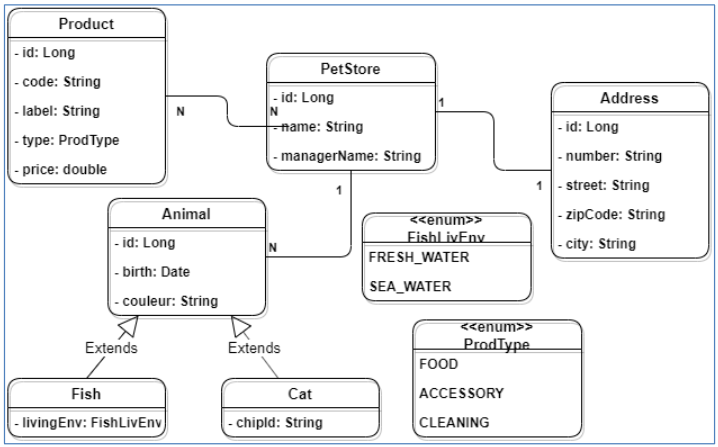

# Mon application d'animalerie (*petstore*)
**Pauline Bouyssou**

Application gestionnaire d'animalerie développé en Java avec l'ORM Hibernate permettant de mapper des entités en base de données relationnelle.

## Sommaire
1. [Contexte](#contexte)
2. [Pré-requis](#pré-requis)\
    2.1. [Dépendances](#dépendances)\
    2.2. [Installation](#installation)\
    2.3. [Configuration](#configuration)

## Contexte
Ce projet concerne le développement d'une application JAVA de gestion d'animalerie permettant de **mapper les entités de l'animalerie vers une base de données** à l'aide de Java Persistence API (JPA) et de l'ORM Hibernate.\
Après mapping des entités à partir du code, toutes les opérations de CRUD doivent pouvoir être exécutées dans le programme pour interagir avec cette base de données.

*L'application ne présente pas d'interface graphique/console pour le moment.*

### Modélisation de la base de données
La modélisation de la base de données suivante nous a été apportée par le client.\
Elle décrit la structure et les relations qui doivent exister entre les données dans la base de données.



### Base de données
La base de données choisie ici est MariaDB, mais vous pouvez utiliser la base de données relationnelle de votre choix en configurant le fichier persistence.xml (cf [Configuration](#configuration)).

Le serveur utilisé tourne sur notre machine locale (utilisation de l'IP localhost (127.0.0.1)).\
Il vous faudra

### Mapping Objet-Relation (O/R)
Dans notre application, le mapping entités-tables est réalisé à l'aide de l'API proposée par JPA (version 3.1) et l'ORM Hibernate, qui apporte une abstraction supplémentaire par rapport à JDBC.\
L'approche choisie est une approche code-first : l'exécution de notre programme à l'aide de JPA permet la création des tables en base de données, à partir des classes objets entités.

Quelques insertions sont ensuite réalisées, et quelques requêtes JPA et JPQL sont faites pour récupérer des enregistrements de la base de données, et les afficher dans la console.

## Pré-requis

### Dépendances
- **JDK Java >= 17.0**
- **Gestionnaire de projet [Maven](https://maven.apache.org/)**
- **Système de Gestion de Base de Données Relationnelles (SGBDR) de votre choix** avec création d'une base de données locale (cf [Installation](#installation))
- **Librairie java associée à votre SGBDR** (par exemple [mariadb-java-client](https://mvnrepository.com/artifact/org.mariadb.jdbc/mariadb-java-client) pour MariaDB) : permet de connecter des applications Java à une base de données MariaDB.
- **Librairie de l'ORM [Hibernate](https://mvnrepository.com/artifact/org.hibernate.orm/hibernate-core)** : application Object Relation Mapping --> abstraction supplémentaire pour aider au mapping et à l'interaction avec une base de données.

Pour les deux librairies utilisées, les dépendances transitives sont listées sur la page de la librairie sur Maven Repository (liens précédents). Elles sont déjà listées dans les dépendances du fichier pom.xml du projet.\
Le gestionnaire de projet Maven les installera automatiquement si vous lui passez ces deux dépendances.

### Installation
Il vous faut faire tourner un **serveur local** sur votre machine pour héberger une SGBDR et pouvoir utiliser ce programme.\
Il vous faudra ensuite créer une **base de données vide** qui sera liée à l'application grâce aux configurations que nous verrons dans la partie suivante. Dans notre application, la base de données est appelée "petstore".

### Configuration
#### Fichier persistence.xml
Ce fichier contient la **configuration de base pour le mapping avec JPA**.\
Il fournit entre autres les informations de connexion à la base de données, et définit les interactions autorisées avec la base de données (création de table, suppression (drop), update...).

Commencez par créer un dossier src/main/resources/META-INF dans le dossier dans lequel vous créerez le fichier *persistence.xml*.

Voici la structure de base de votre fichier :
```
<?xml version="1.0" encoding="UTF-8" standalone="yes" ?>
<persistence xmlns="https://jakarta.ee/xml/ns/persistence"
             xmlns:xsi="http://www.w3.org/2001/XMLSchema-instance"
             xsi:schemaLocation="https://jakarta.ee/xml/ns/persistence https://jakarta.ee/xml/ns/persistence/persistence_3_1.xsd"
             version="3.1">

    <persistence-unit name=" ?? ">
        <provider>org.hibernate.jpa.HibernatePersistenceProvider</provider>

        <properties>
            <property name="jakarta.persistence.jdbc.url" value=" ??? "/>
            <property name="jakarta.persistence.jdbc.user" value=" ??? "/>
            <property name="jakarta.persistence.jdbc.password" value=" ??? "/>
            <property name="jakarta.persistence.jdbc.driver" value=" ??? "/>

            <property name="hibernate.hbm2ddl.auto" value="create"/>

            <property name="hibernate.show_sql" value="true"/>
            <property name="hibernate.format_sql" value="true"/>
        </properties>

    </persistence-unit>
</persistence>
```
La racine de ce document XML est le tag `<persistence>`. Dans notre cas, nous utilisons la **version 3.1. de JPA**.

Les "???" sont à remplacer par vos propres informations. Voyons pas à pas chaque élément.

#### Tag persistence-unit
La ligne `<persistence-unit name=" ?? ">` : paramètre d'un persistence-unit (il peut y en avoir plusieurs).\
L'attribut `name` est obligatoire et précise le nom de l'unité, qui servira de référence.

Le nom donné dans le projet est "petstore-jpa". Si vous souhaitez utiliser un autre nom il faudra **absolument compléter ce nouveau nom en argument de l'EntityManagerFactory emf** dans la classe `PersistenceManager.java`, méthode `getEntityManagerFactory()` ligne 22.

#### Tags de connexion à la base de données
La ligne `<property name="jakarta.persistence.jdbc.url" value=" ??? "/>` : indique l'adresse de la base de données. Il faut donc indiquer le pattern suivante dans l'attribut `value` : "protocole_jdbc:sous-protocole_sgbd://adresse_du_serveur:port_d'écoute/nom_base_de_données".

Par exemple, pour se connecter à une base de données MariaDB sur un serveur localhost, écoutant sur le port 3307, pour une base de données appelée "petstore", voici la valeur à entrer : `jdbc:mariadb://localhost:3307/petstore`.

La ligne suivante `<property name="jakarta.persistence.jdbc.user" value=" ??? "/>` nécessite que vous indiquez l'utilisateur qui se connectera à la base de données et effectuera les opérations via l'ORM.\
Il faut que cet utilisateur est les droits de modifications lui permettant de faire les opérations que vous réalisez dans le programme (ex : create/drop, alter, insert...).

Enfin, la ligne suivante `<property name="jakarta.persistence.jdbc.password" value=" ??? "/>` indique le mot de passe rattaché à l'utilisateur cité précédemment. S'il n'y a pas de mot de passe, laissez la String vide.

#### Tags driver
Cette propriété est facultative.\
Pour une base de données MariaDB, on utilise le driver suivant : `org.mariadb.jdbc.Driver`.

#### Tags de permissions d'actions sur la base de données
Pour notre programme, la propriété `<property name="hibernate.hbm2ddl.auto" value="create"/>` devrait suffire à créer les tables dans votre base de données vide.\
La propriété suivante peut aussi être ajoutée pour autoriser le drop des tables existantes avant la création des nouvelles tables : `<property name="jakarta.persistence.schema-generation.database.action" value="drop-and-create"/>`. Attention cependant : les tables précédemment créées sont intégralement supprimées et remplacées par les nouvelles tables données à chaque exécution du programme.

#### Tags concernant les requêtes SQL

Les deux dernières options sont facultatives et permettent notamment de visualiser dans la console les requêtes SQL faites par l'ORM.

---

Bravo : vous êtes prêt(e) à utiliser le programme !